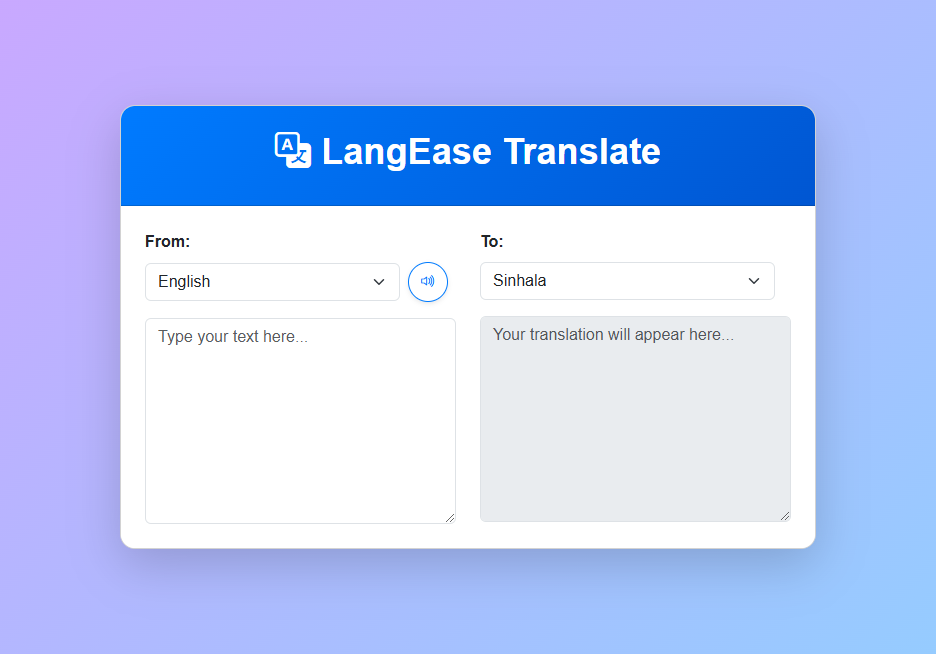

# **LangEase Translator**

## **Overview**
The LangEase Translator is a web-based application designed to provide seamless language translation and English speech synthesis. It features a clean and modern user interface and leverages the MyMemory Translated API to perform translations efficiently. Users can dynamically select languages, input text, and listen to English translations with ease.

---

## **Features**
- **Language Selection**:
  - Dynamically choose source and target languages.
  - Default language settings: English (en-GB) to Sinhala (si-LK).
- **Instant Translation**:
  - Translate text in real-time using the MyMemory Translated API.
- **Speech Synthesis**:
  - Listen to the English translations with the browser's built-in Speech Synthesis API.
- **Loading Indicator**:
  - Displays a stylish spinner while fetching translations.
- **Responsive Design**:
  - Built with Bootstrap for a modern and intuitive user interface.

---

## **Technologies Used**
- **Programming Languages**: HTML, CSS, JavaScript
- **Framework**: Bootstrap
- **API**: MyMemory Translated API for translations
- **Browser Feature**: Speech Synthesis API for audio output

---

## **Project Status**
- **Completed**: The app is fully functional and ready for deployment.

---

## **Usage**
1. **Select Languages**: Use the dropdown menus to select the source and target languages.
2. **Input Text**: Type or paste the text to be translated into the input box.
3. **View Translation**: The translated text appears instantly in the output box.
4. **Listen to Translation**: Click the speaker icon to hear the English translation (if applicable).

---

## **Screenshots**
### **Main UI Screenshot**

---

## **Contributing**
Contributions are welcome! If you would like to contribute to this project, please fork the repository and submit a pull request with your changes. Ensure that your code follows best practices.

---

## **License**
This project is licensed under the MIT License. See the LICENSE file for more details.

---

## **Credits**
- **Developer**: Nipun Basnayake
- **Libraries Used**:
  - Bootstrap for UI
  - MyMemory Translated API for translations

---

## **Contact**
For feedback, questions, or collaboration, reach out to:
- Email: [nipunsathsara1999@gmail.com](mailto:nipunsathsara1999@gmail.com)
- GitHub: [NipunBasnayake](https://github.com/NipunBasnayake)
